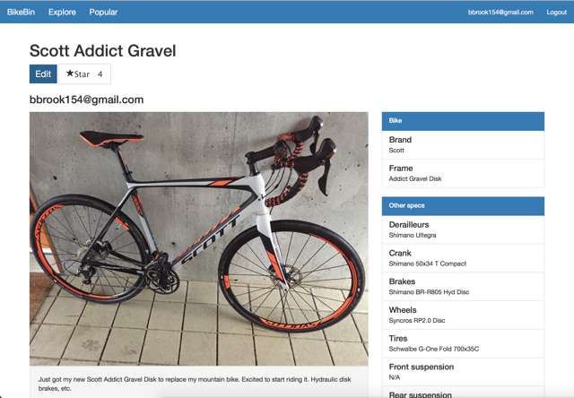

## computer science student at oregon state university, class of 2016

### Work Experience

---

#### Mentor Graphics: *Software Engineering Intern*

**_March 2015-September 2015_**

* Wrote a new error reporting system in C++ that streamlined the process for developers to output and filter error messages and warnings.
* Expanded the coverage of regression tests for products with limited testing.
* Performed performance analyses to find hotspots in code and worked on several potential
solutions to increase speed.

---

#### Oregon State University Department of Computer Science: *Student Researcher*

**_September 2015-Present_**

* Assist Dr. Scott Sanner and one of his graduate students in machine learning research. 
* Gather large geospatial datasets for use in piecewise Bayesian models.
* Presented a poster at the 2016 Oregon State Graduate Student Expo

---

#### Business Solutions Group: *Student Lab Manager*

**_April 2013-Present_**

* Perform various hardware and software tests on enterprise networking equipment. – Coordinate new and upcoming projects for a lab of 5-6 students.
* Create bug reports for developers.

### Projects

---

* [BikeBin](http://bikebin.co) is an ongoing project that allows proud bike owners to share their bikes with other passionate enthusiasts.
* Currently under development at [github.com/benrbrook/bikebin](https://github.com/benrbrook/bikebin), with a live version at [bikebin.co](http://bikebin.co).
* Built with Meteor, which runs on top of Node.js to allow for both front and back end development in JavaScript.

