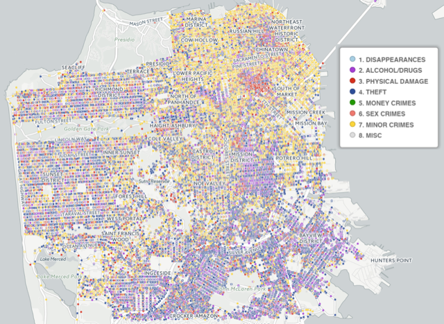

## software engineering intern

### Work Experience

---

#### TrueCar: *Software Engineering Intern*

**_June 2016 - Present_**

* Create Spark pipelines for data processing and machine learning to aid price prediction.
* Develop a highly efficient API server in Scala to evaluate predictions and update models.
* Create a front end for the API in React.js.

---

#### Mentor Graphics: *Software Engineering Intern*

**_March 2015 - September 2015_**

* Wrote a new error reporting system in C++ that streamlined the process for developers to output and filter error messages and warnings.
* Expanded the coverage of regression tests for products with limited testing.
* Performed performance analyses to find hotspots in code and worked on several potential
solutions to increase speed.

---

#### Oregon State University Department of Computer Science: *Student Researcher*

**_September 2015 - March 2015_**

* Assisted Dr. Scott Sanner and one of his graduate students in machine learning research. 
* Gathered large geospatial datasets for use in piecewise Bayesian models.
* Presented a poster at the 2016 Oregon State Graduate Research Expo

---

#### Business Solutions Group: *Student Lab Manager*

**_April 2013 - June 2016_**

* Perform various hardware and software tests on enterprise networking equipment. 
* Coordinate new and upcoming projects for a lab of 5-6 students.
* Create bug reports for developers.

### Education

---

#### Oregon State University: *BS Computer Science w/ Computer Systems*

**_January 2013 - September 2016_**

### Projects

---

#### BikeBin

* [BikeBin](http://bikebin.co) is an ongoing project that allows proud bike owners to share their bikes with other passionate enthusiasts.
* Currently under development at [github.com/benrbrook/bikebin](https://github.com/benrbrook/bikebin), with a live version at [bikebin.co](http://bikebin.co).
* Built with Meteor, which runs on top of Node.js to allow for both front and back end development in JavaScript.

#### SF Crime Classification

* Final project for CS 434 Machine Learning.
* We took 12 years of crime data from the City of San Francisco.
* Predicted crime category (assault, robbery, vandalism, etc.) based on time and location.
* Compared the viability of different classifiers (k-NN, random forest, etc.).
* High accuracy (log loss of 3.5) with tuned hyperparameters. 
* Created a report [viewable here](documents/san-francisco-crime.pdf). 

